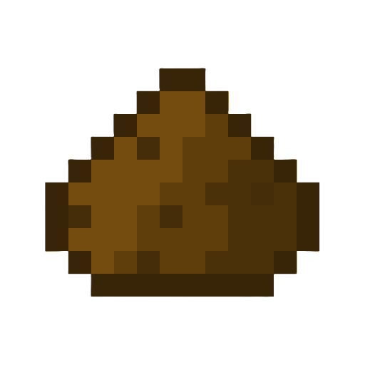

# WoodMek! - A 1.21-1.21.1 NeoForge Minecraft Mod 

Adds wood-based materials with deep Mekanism integration and cross-mod compatibility. Features custom recipes via datapacks.

## Showcase
### Mod Items

### WoodMek Creative Tabs (Wood Items & Blocks)

---

### Processing Workflows (New in v3.0.0)
**1. Harvest Logs**  
*Gathered from vanilla loot tables when chopping trees*  
  
*(standard Minecraft wood collection)*

**2. Crush Logs to Wood Dust**  
  
*Process logs through Mekanism's Crusher to create Wood Dust*

**3. Smelt Wood Dust to Hard Wood**  
  
*Smelt Wood Dust in any furnace to create Hard Wood, note that mekanism has a furnance like machine (any furnace will work)*

**4. Infuse Hard Wood to Hardwood Alloy**  
  
*Infuse Hard Wood with Carbon in a Metallurgic Infuser to create Hardwood Alloy*

**5. Compact Alloy Production (Efficiency Boost)**  
  
*Process Hard Wood Blocks (each made from 9 Hard Wood in a 3x3 craft) to get 9x Hardwood Alloy - more efficient than processing individual Hard Wood items!*

---
## FTB Quests

**Overview**  
  
*With any new mod/modpack, a quest is needed and so using FTB quests. Iv created just that.*

**Quest Item**  
  
*With each item, comes a description and a linear progression to help players know what steps to take to get to each milestone with custom rewards!*

---
## Items

### Wood Sheets
  

- **v2.0 Update**: Detailed wood grain texture
- **Obtained by**:
  - Crafting recipes
  - Chopping wood (vanilla loot tables)
- **Processing**: Smelt into Hard Wood or crush into Wood Dust

### Hard Wood
  

- **v2.0 Update**: Carbonized texture
- **Uses**:
  - Crafted into Hard Wood Blocks (2x2 pattern)
  - Processed into Hardwood Alloy via Infusion

### Wood Dust
 

- **New in v2.0**: Fine wood powder
- **Creation**: Crush Wood Sheets in Crusher
- **Purpose**: Intermediate for advanced alloys

### Hardwood Alloy
  

- **Crafting**: Metallurgic Infuser (Hard Wood + Carbon)
- **v3.0 Feature**: Cross-mod recipe support via datapacks

### Chisel
  

- **v3.5.0 Update**: Chisel
- **Uses**:
  - Turn set blocks into its counterpart

### Transformer Block
  

- **v4.0.0 Update**: Transformer
- **Uses**:
  - Turns entities thrown ontop to their upgraded versions
  - Wood dust into hardwood alloys
  - Hardwood into hardwood block
  - Works for single items and stacks of items

---

## 🏗️ Building Blocks
1. **Hard Wood Block**:
   - Crafted from 4 Hard Wood (2x2)
   - Seamless edge design
2. **Hazard Block**:
   - Decorative warning block
   - Seamless texture integration

---

## Changelog
### Latest Release = 4.0.2

#### [4.0.2] - Burn Rates
- Added a `burn time` to all wooden items with all  values based on the level on compactness and difficulty
-   

#### [4.0.0] - Custom Block (Transformer)
- Added a `Transformer` block that can turn items (non modded and modded) into there `upgraded` counterparts
- Example of transformations include wood dust into hardwood alloy. hardwood into hardwood_block
- Added recipe for the transformer

#### [3.8.0] - Custom Items (Chisel)
- Added a building `Chisel` that can turn basic blocks into there building block counterparts 

#### [3.0.0] - Cross-Mod Compatibility & Recipes
- Full `Mekanism` recipe integration via datapacks
- Custom `processing GUIs` (see Processing Workflows)
- Compact machine workflows
- Added `pics` folder for this repo documentation and assets
- `FTB Quest` intergration (shown in quests)
- Backend support for modpack recipe overrides

#### [2.0.0] - Loot tables, Recipes & New Content
- Texture updates for Hard Wood/Wood Sheets
- Wood Dust item + crusher recipes
- Loot table fixes for block drops
- Sound type additions for blocks

### [1.5.1] - Modpack compatible with NeoForge Mods (Mekanism, Create, FTB Ultimine and JEI)
- Modpack `WoodMek` on CurseForge with Mekanism, JEI, FTB Ultimine (Forge) and Create (Version 6)
- Arguably most important version and proof the swap to NeoForge from Forge was for the best

### [1.0.5] - Blocks
- Added blocks: Hazard and Hardwood Blocks alongside their inventory counterpart items (rendering on minecraft:block/cube_all) 
- Created building blocks category for the creative tab

### [1.0.0] - Initial Release + Items
- Added base items: Wood Sheets, Hard Wood and Hardwood Alloy
- Added two creative inventory tabs for wood items and another for building blocks
- Backend for future releases (e.g., loot tables, recipes, textures)

### [0.0.1] - Pre-Release
- Base foundation porting all previous code from Forge to NeoForge for future compatibility, performance and more
- Setting up directories, Minecraft documentation, build files etc.
- Established gradle.properties for mod name (now officially WoodMek)
- Mod_id=blockmod + MIT license + mod_group_id=net.umf.blockmod

---

## Installation
CuresForge Mod coming soon!
**Requires Mekanism 10.4+**

