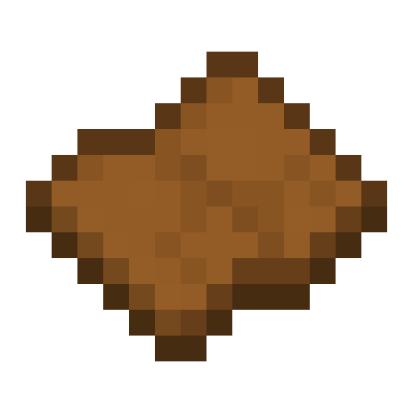
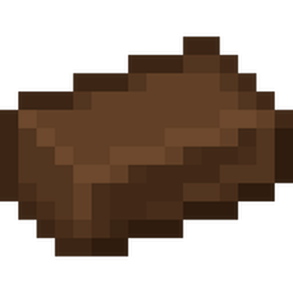
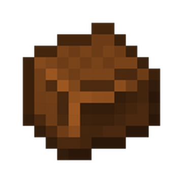

 

 

 
### Latest Release 6.5.0

<a href="https://www.curseforge.com/minecraft/mc-mods/woodmek">
  CurseForge Mod Page
</a>

  

Wood Mekanism or WookMek for short is a 1.21 NeoForge Minecraft Mod which adds wood-based materials with deep Mekanism integration and cross-mod compatibility. Features custom recipes via datapacks.

   

<h1><strong>WoodMek Showcase</strong></h1> 

> [!IMPORTANT]
> This mod is a WIP, these ingame screenshots may or may not be the latest reflection of the WoodMek mod (Including blocks, items, features or functions).

### Mod Items

### WoodMek Creative Tabs (Wood Items & Blocks)

---

### Processing Workflows (New in v3.0.0)
**1. Harvest Logs**  
*Gathered from vanilla loot tables when chopping trees*  
  
*(standard Minecraft wood collection)*

**2. Crush Logs to Wood Dust**  
  
*Process logs through Mekanism's Crusher to create Wood Dust*

**3. Smelt Wood Dust to Hard Wood**  
  
*Smelt Wood Dust in any furnace to create Hard Wood, note that mekanism has a furnance like machine (any furnace will work)*

**4. Infuse Hard Wood to Hardwood Alloy**  
  
*Infuse Hard Wood with Carbon in a Metallurgic Infuser to create Hardwood Alloy*

**5. Compact Alloy Production (Efficiency Boost)**  
  
*Process Hard Wood Blocks (each made from 9 Hard Wood in a 3x3 craft) to get 9x Hardwood Alloy - more efficient than processing individual Hard Wood items!*

---

# Future Plans

WoodMek isn’t just about early-game mod you use once or twice, there’s much more on the horizon im planning to add. 

## Planned features include:
• **Axe progression overhaul:** introducing stronger, more efficient axes with a meaningful upgrade path  
• **Treecapitator-style mechanics:**  cut entire trees with one swing  
• **No-block tree farming (generators):**  automatic tree growth and harvesting  
• **Auto item pickup:**  seamless integration with existing farms  
• **Late-game wood usage:**  features that give purpose to large stockpiles of wood

These additions aim to make WoodMek a long-term companion in your modpack, especially in mid to late game stages where bulk wood production and usage become key.

---

## FTB Quests

**Overview**  
  
*With any new mod/modpack, a quest is needed and so using FTB quests. Iv created just that.*

**Quest Item**  
  
*With each item, comes a description and a linear progression to help players know what steps to take to get to each milestone with custom rewards!*

---

## Items

### Wood Sheets
  

- **v2.0 Update**: Detailed wood grain texture
- **Obtained by**:
  - Crafting recipes
  - Chopping wood (vanilla loot tables)
- **Processing**: Smelt into Hard Wood or crush into Wood Dust

### Hard Wood
  

- **v2.0 Update**: Carbonized texture
- **Uses**:
  - Crafted into Hard Wood Blocks (2x2 pattern)
  - Processed into Hardwood Alloy via Infusion

### Wood Dust
 

- **New in v2.0**: Fine wood powder
- **Creation**: Crush Wood Sheets in Crusher
- **Purpose**: Intermediate for advanced alloys

### Hardwood Alloy
  

- **Crafting**: Metallurgic Infuser (Hard Wood + Carbon)
- **v3.0 Feature**: Cross-mod recipe support via datapacks

### Chisel
  

- **v3.5.0 Update**: Chisel
- **Uses**:
  - Turn set blocks into its counterpart

### Transformer Block
  

- **v4.0.0 Update**: Transformer
- **Uses**:
  - Turns entities thrown ontop to their upgraded versions
  - Wood dust into hardwood alloys
  - Hardwood into hardwood block
  - Works for single items and stacks of items

---

## Changelog

#### [6.5.0] - Mini hazard block
- Added a new mini hazardblock

#### [6.4.0] - Polished hardwood Block (2 varients)
- Added a new polished hardwood blcok to go with the new lamp with 2 varients, dented and undented

#### [6.3.0] - Retexture
- Rextured the base hardwood items and added  hardwood bricks 

#### [6.0.0] - Now a standalone mod! - Recipes, Hazard Blocks and ModID Changes
- Added a second hazard block: **Half Hazard Block**
  - Both hazard blocks now have recipes:  
    4x Stone + 1x Yellow Dye
    
    
    
  - Both blocks support **directional movement** with the chisel  
    (rotate 90° back and forth)
- Added a new **Blockstate Lamp**
  - Reacts to click inputs and uses blockstates for toggling on/off
  -   
  -   
- **Rewrote and restructured the entire project**  
  - Renamed mod from `blockmod` to `woodmek`  
  - New Mod ID: `woodmek` / `WoodMek`
- **Mekanism recipes now built-in**  
  - No datapack required  
  - Recipes are loaded automatically through mod data  
  - Fully functional integration with **Mekanism**

#### [5.5.0] - DataGen
- Added stairs, buttons, doors, fences and fence gates, slabs, walls, pressure plates and trapdoors

#### [5.0.0] - DataGen
- Converted all loot tables, block states, block/item tags, data maps, item models, and recipes to data generators for easier maintenance and future updates.

#### [4.6.0] - Tool Tips
- Added a `Tool tips` to complex items such as the Chisel and the Transformer block

  

  

    

#### [4.2.0] - Burn Rates
- Added a `burn time` to all wooden items with all  values based on the level on compactness and difficulty  
    

#### [4.0.0] - Custom Block (Transformer)
- Added a `Transformer` block that can turn items (non modded and modded) into their `upgraded` counterparts
- Example of transformations include wood dust into hardwood alloy. hardwood into hardwood_block
- Added recipe for the transformer

#### [3.8.0] - Custom Items (Chisel)
- Added a building `Chisel` that can turn basic blocks into their building block counterparts 

#### [3.4.0] - Cross-Mod Compatibility & Recipes
- Full `Mekanism` recipe integration via datapacks
- Custom `processing GUIs` (see Processing Workflows)
- Compact machine workflows
- Added `pics` folder for this repo documentation and assets
- `FTB Quest` integration (shown in quests)
- Backend support for modpack recipe overrides

#### [2.0.0] - Loot tables, Recipes & New Content
- Texture updates for Hard Wood/Wood Sheets
- Wood Dust item + crusher recipes
- Loot table fixes for block drops
- Sound type additions for blocks

### [1.5.1] - Modpack compatible with NeoForge Mods (Mekanism, Create, FTB Ultimine and JEI)
- Modpack `WoodMek` on CurseForge with Mekanism, JEI, FTB Ultimine (Forge) and Create (Version 6)
- Arguably most important version and proof the swap to NeoForge from Forge was for the best

### [1.0.5] - Blocks
- Added blocks: Hazard and Hardwood Blocks alongside their inventory counterpart items (rendering on minecraft:block/cube_all) 
- Created building blocks category for the creative tab

### [1.0.0] - Initial Release + Items
- Added base items: Wood Sheets, Hard Wood and Hardwood Alloy
- Added two creative inventory tabs for wood items and another for building blocks
- Backend for future releases (e.g., loot tables, recipes, textures)

### [0.0.1] - Pre-Release
- Base foundation porting all previous code from Forge to NeoForge for future compatibility, performance and more
- Setting up directories, Minecraft documentation, build files etc.
- Established gradle.properties for mod name (now officially WoodMek)
- Mod_id=blockmod + MIT license + mod_group_id=net.umf.blockmod

---

## Installation
CurseForge Mod: https://www.curseforge.com/minecraft/mc-mods/woodmek
