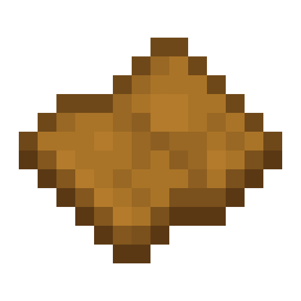
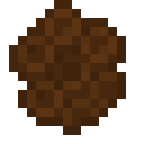
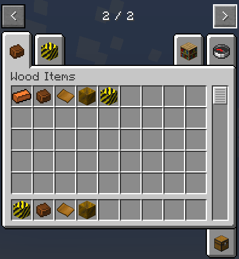

# BlockMod - A Minecraft Mod for NeoForge

Adds new wood-based materials and integration with Mekanism. Features two new creative tabs for organization and seamless building blocks.

## Showcase

## Items

### Wood Sheets
 

- **Obtained by**:
  1. Crafting recipes
  2. Chopping wood (I modified vanilla loot tables)
- **Primary use**: Base material for advanced components eg the hard wood then hard wood into hardwood alloy

### Hard Wood

- Created by smelting Wood Sheets
- **Uses**:
  1. Crafted into Hard Wood Blocks (2x2 pattern)
  2. Processed into Hardwood Alloy

### Hardwood Alloy

- Created in Mekanism's **Metallurgic Infuser**:
  - Input Hard Wood + Carbon (coal/charcoal or any carbon mod ID)
- **Purpose**: tech side no purpose yet, but can be crafted with yellow concrete to make hazard blocks

### 🏗️ Building Blocks
1. **Hard Wood Block**:
   - Crafted from 4 Hard Wood (2x2 pattern)
   - Textured seamless edges
   
2. **Hazard Block**:
   - Decorative block with warning styling
   - Seamless edge design

*(Both blocks visible in Showcase)*

### 📦 Creative Tabs

---

## Installation

Ill post it once fully polished onto forge luancher + modpack with Mekanism 
