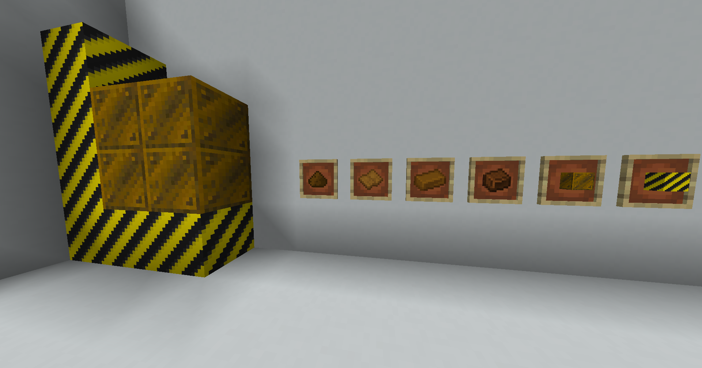

# WoodMek! - A 1.21-1.21.1 NeoForge Minecraft Mod 

Adds wood-based materials with deep Mekanism integration and cross-mod compatibility. Features custom recipes via datapacks.

## Showcase
### Mod Items

### Mekanism Integration

### 🛠️ Processing Workflows (New in v3.0.0)
**Smelting Wood Sheets**  

**Infusing Hardwood Alloy**  

**Compact Alloy Production**  

**Crushing to Wood Dust**  

---

## Items

### Wood Sheets
  

- **v2.0 Update**: Detailed wood grain texture
- **Obtained by**:
  - Crafting recipes
  - Chopping wood (vanilla loot tables)
- **Processing**: Smelt into Hard Wood or crush into Wood Dust

### Hard Wood
  

- **v2.0 Update**: Carbonized texture
- **Uses**:
  - Crafted into Hard Wood Blocks (2x2 pattern)
  - Processed into Hardwood Alloy via Infusion

### Wood Dust
  

- **New in v2.0**: Fine wood powder
- **Creation**: Crush Wood Sheets in Crusher
- **Purpose**: Intermediate for advanced alloys

### Hardwood Alloy
  

- **Crafting**: Metallurgic Infuser (Hard Wood + Carbon)
- **v3.0 Feature**: Cross-mod recipe support via datapacks

---

## 🏗️ Building Blocks
1. **Hard Wood Block**:
   - Crafted from 4 Hard Wood (2x2)
   - Seamless edge design
2. **Hazard Block**:
   - Decorative warning block
   - Seamless texture integration

---

## Changelog
### Latest Release = 3.0.0
#### [3.0.0] - Cross-Mod Compatibility & Recipes
- **NEW**: Full Mekanism recipe integration via datapacks
- **NEW**: Custom processing GUIs (see Showcase)
- **NEW**: Compact machine workflows
- Added `pics` folder for expanded documentation assets
- Backend support for modpack recipe overrides

#### [2.0.0] - Loot tables, Recipes & New Content
- Texture updates for Hard Wood/Wood Sheets
- Wood Dust item + crusher recipes
- Loot table fixes for block drops
- Sound type additions for blocks

*(Older versions unchanged)*

---

## Installation
CurseForge Code: `EZeorNuJ`  
**Requires Mekanism 10.4+**
